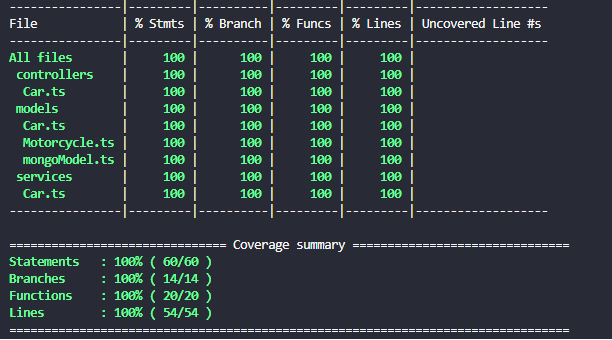

# CAR SHOP 🚗

## 📄 Sobre | About
<details>
  <summary>
    <strong>PT</strong>
  </summary><br>
  API com CRUD para gerenciar uma concessionária de veículos utilizando o banco de dados MongoDB

  <br>

  🎯 O objetivo foi aplicar os princípios de Programação Orientada a Objetos (POO)

  🧪 A API foi testada usando Sinon, Mocha e Chai.<br>
</details>

<details>
  <summary>
    <strong>EN</strong>
  </summary><br>
  CRUD API to manage a car dealership with MongoDB database

  <br>

  🎯 The goal was to apply the principles of Object Oriented Programming (OOP)

  🧪 The API is tested using Sinon, Mocha and Chai.<br>
</details>
<br>

## 🛠️ Ferramentas | Tools
* [TypeScript](https://www.typescriptlang.org/)
* [MongoDB](https://www.mongodb.com/)
* [Express](https://expressjs.com/)
* [Node](https://nodejs.org/en/)
* [Zod](https://github.com/colinhacks/zod#introduction)
* [express-async-errors](https://www.npmjs.com/package/express-async-errors)
* [ts-node-dev](https://www.npmjs.com/package/ts-node-dev)
* [Chai](https://www.chaijs.com/)
* [Sinon](https://sinonjs.org/)
* [Mocha](https://mochajs.org/)
<!-- * [Swagger](https://swagger.io/) -->
<br>

---

## ✨Rotas | Routes

Feature | Route
------- | ------
Create a car | POST /cars
List cars | GET /cars
Get car by ID | GET /cars/:id
Update a car | PUT /cars/:id
Delete a car | DELETE /cars/:id
Create a motorcycles | POST /motorcycles
List motorcycles | GET /motorcycles
Get motorcycles by ID | GET /motorcycles/:id
Update a motorcycles | PUT /motorcycles/:id
Delete a motorcycles | DELETE /motorcycles/:id

<!-- ## 📜Documentation
Access the route `/api-docs` to see the documentation.

Ex.: `http://localhost:3000/api-docs`

<br> -->

---

 ## ⚒️ Como rodar a aplicação | How to run the application
<details>
  <summary> PT </summary> <br>

  Faça Download:
  ```
  git clone git@github.com:queite/car-shop.git
  ```
  Entre na pasta rauz:
  ```
  cd car-shop
  ```
  Rode os serviços node e mongodb:
  ```
  docker-compose up -d
  ```
  ⚠ Esses serviços irão inicializar um container chamado car_shop e outro chamado car_shop_db.

  Entre no container:
  ```
  docker exec -it car_shop bash
  ```
  Instale as dependências:
  ```
  npm install
  ```
  ⚠ Caso opte por utilizar o Docker, TODOS os comandos disponíveis no package.json (npm start, npm test, npm run dev, ...) devem ser executados DENTRO do container.
</details>

<details>
  <summary> EN </summary> <br>

  Download the code:
  ```
  git clone git@github.com:queite/car-shop.git
  ```
  Enter the root folder:
  ```
  cd car-shop
  ```
  Run the services node and mongodb:
  ```
  docker-compose up -d
  ```
  ⚠ These services are going to start a container called car_shop and another called car_shop_db.

  Enter the container:
  ```
  docker exec -it car_shop bash
  ```
  Install dependencies:
  ```
  npm install
  ```
  ⚠ If you choose to use Docker, ALL commands available in package.json (npm start, npm test, npm run dev, ...) must be executed WITHIN the container.
</details>
<br>

## 🧪 Testes | Tests

### ⚙️ **Rode os testes | Run the tests**
<details>
  <summary> EN </summary> <br>
  Unit tests were created for 100% coverage of this API.<br>

  Run tests
  ```
  npm run test:dev
  ```
  Run tests coverage
  ```
  npm run test:coverage
  ```
</details>

<details>
  <summary> PT </summary> <br>
  Foram criados testes unitários para uma cobertura de 100% desta API.<br>

  Rode os testes
  ```
  npm run test:dev
  ```
  Rode a cobertura de testes
  ```
  npm run test:coverage
  ```
</details>

---
PT<br>
Projeto desenvolvido durante o módulo de back-end na [Trybe](https://www.betrybe.com/).<br/>
Todos os projetos da [Trybe](https://www.betrybe.com/) usam `linters`, `Git` and `GitHub`.<br/>

EN<br>
Project developed in the back-end module at the [Trybe](https://www.betrybe.com/) course.<br/>
All [Trybe](https://www.betrybe.com/) projects use `linters`, `Git` and `GitHub`.<br/>